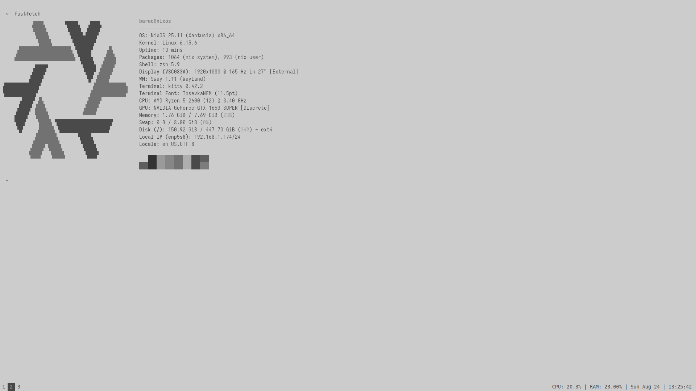

<h1 align="center">dot files</h1>

  

<h2> 🛠 </h2>
<ul>
    <li><a href="https://st.suckless.org/">term: st</a></li>
    <li><a href="https://dwm.suckless.org/">wm: dwm</a></li>
    <li><a href="https://starship.rs/">shell prompt: starship</a></li>
    <li><a href="https://www.gnu.org/software/bash/">shell: bash</a></li>
    <li><a href="https://github.com/tmux/">terminal multiplexer: tmux</a></li>
    <li><a href="https://neovim.io/">editor: neovim</a></li>
</ul>
